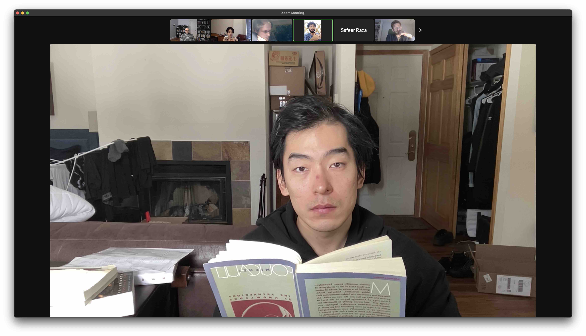

*Me, participating in the Michel Foucault reading group at Copper Mountain, Colorado, 2023*

Last August, prompted by [Andy Matuschak's tweet](https://twitter.com/andy_matuschak/status/1561570914310885376), I did some research into UChicago's Basic Program. To my delight, this program is something I've been looking for for a long time. I signed up, have thoroughly enjoyed the first quarter, and am doing the second quarter right now. Here are some of my impressions and reflections.

## The Curriculum

The Basic Program consists of twelve quarters spread out over four years. In each quarter, a student reads about four books. The curriculum starts from ancient Greek philosophy and literature, and then introduces works that touch upon previously discussed ideas. For example, in the first quarter, we examined the conversation between Socrates and Meno on the question *"is virtue teachable"*. Following up on the topic of virtue, we started reading Aristotle's analysis of virtue in Nichomachean Ethics in the current quarter. In the second year, we'll read more of Plato and Nietzsche's writing on virtue and morality. Such an arrangement, I suppose, makes it possible for us to trace the development of political/social/philosophical that's embedded in the western civilization.

Many books on the curriculum share these characteristics:

- Are dense and thus demand a lot of focus.
- Pique my intellectual interest.
- Are better read under some guidance or contextual information. For example, deep understanding of the development of a philosophy branch would provide context for understanding a specific philosophical work, and some knowledge of Greek language and culture is always useful for comprehending Greek philosophy.
- Can lead to so many interpretations that any single person venturing into them would be accompanied by self-doubt. Did I understand it correctly? Are there other ways to think about those ideas? Is my failure to comprehend it due to my lack of relevant experience? Do I need more historical context to appreciate the work? Did I get all the major points?

As such, I think the selection of books works well for the format of the class. In each class, there's an UChicago instructor who has taught the class a dozen times. They are always helpful in pointing out alternative interpretations, supplementing the class with historical contexts and steering discussions towards the important themes/points. The experience felt so much better than that of reading alone.

## The Class

The class alternates between two sessions. In the seminar, we talk about the reading from a higher level and covers a lot of ground. In the tutorial, we zoom in on a page, a paragraph, a word, and go to great length to dissect a small section of the reading.

The two sessions lead to very different discussions. In the seminar, one of the books we went through is Crime and Punishment. As Dostoesvky explored the idea of crime from different perspectives – that of the murderer, of a detective, of a friend, of a potential lover of the murderer, of a transgressor who blatantly boasts about his wrongful deeds, and of the murderer as a column writer, theorizing about Übermensch that eludes conviction – I started to understand crime differently, not only as a rigid demarcation of law between the lawful and the criminal, but also the soft divide between what's right and wrong by our (or the public's) conscience. The variance of judgement on the murder by different people, and by the protagonist in different times, reflects the rich complexity in a crime.

The conversation in the tutorial centers on shorter excerpts. For example, instead of talking through a whole chapter of a novel, we would focus on one single concept such as "learning by recollection", and debate back and forth. We would start by clarifying the meaning of each word to reach an exact understanding of the author's idea, and then proceed to voicing our opinions. I vouched for that we learn by recollection, and I thought that a good learning experience should be less of a knowledge endowment but more of an arousal, one which poses questions that invite the students onto a journey of discovery, like a Japanese Koan.

Comparing my own reading experience against the class, I would prefer the class for any non-light reading. I used to think of discussions as an optional add-on to reading, but the class had convinced me that discussion should be an integral part of a learning experience. In the class, I found my perspective broadened by my classmates and my understanding deepened through my engagement in the conversation. One incredible thing I found is that even the act of speaking out my thoughts would often give me new ideas or understandings. It is similar to how authors often find their ideas developing as they put ideas to words.

## Remote Learning

I love the flexibility that remote learning offers. In the first quarter, I have taken the class at my home, at a coffee shop while attending a company retreat and at a hotel while traveling to Montreal. One time, I tuned in on a session while driving. Another time, I missed a session while moving from NYC to Colorado, and made up for it by watching the recording.

Thinking from a media perspective, the remote class allows multiple modes of participation. One thing I started doing is once in a while, if I feel like it, I turn off the video to make coffee for myself or pace in the room, while listening and thinking through the discussion. I find myself engaging in the class rather differently when the video is off. I no longer feel the presence of others and the pressure to engage. In Marshall McLuhan's words, this would be a shift from a cool media to a hot media, and it fascinates me how the majority of my more original, profound thinking came to me while I'm listening to the discussion, away from the screen. It's difficult to explain, but I feel like I think better if I only have to listen. In a traditional classroom, I used to look into the void if I want to think. I never had much success thinking well if I'm looking at the instructor.

## More Online Classes!

I think I fell in love with remote learning. This winter, other than the Basic Program, I signed up for two more online programs:

- A [Catherine Project](https://catherineproject.org) reading group on Michel Foucault's The Archeology of Knowledge
- [Emergency Break](https://mp.weixin.qq.com/s/QuAfFbofA6v-cLCgxUvSkA), a Chinese photography lecture/critique

Foucault has been a challenging read, but my classmates were excellent in deciphering his writing. I would often come to each class with only a vague understanding of the writing but then leave with a much better grasp of Foucault's ideas. For an open and free reading group, the quality of discussion has far exceeded my expectations. I'll write more about this class once I'm done with it.

As for the photography class, I signed up out of interest in the philosophy of photography. I did a film photography class in college, but somehow ended up spending more time reading Sontag, Benjamin and Barthes instead of taking photos. So far, we had two lectures and one critique, and I love the critique! Three past attendees would share their work-in-progress with the rest of the group, and the selected critics would comment on their work. I have always had trouble compiling my photos into a coherent portfolio with a strong statement, and seeing how others do it & how the critics comment on their works is rather eye-opening for me.

## Some Random Reflections

The online classes have fulfilled my sore need of intellectual conversations. Prior to attending this program, I would dedicate some time for serious reading and movie-watching every week, but I couldn't find anyone to discuss with. In real life, it's impossible to even find someone who's interested in the same books/movies that you are interested in, let alone someone to engage in a deep discussion with. Most of the conversation begins and ends with my mere explanation of the subject matter.

Maybe online is the way to find like-minded people to undertake such endeavors? Here is an open invitation: I built https://funes.matsu.io to record my media consumption history. If you happen to enjoy the same book/movie as I did, email me and let's do a zoom meeting and chat about it!

Last year, I started to dig deeper on a few subjects. My approach was quite naive. I pick the subject, find an article or list, and just go through everything that's there. The two subjects I chose were:

- Bebop: I gave every musician mentioned in [Wikipedia's Bebop entry](https://en.wikipedia.org/wiki/Bebop) a listen on Spotify.
- Existentialism: I read through Stanford Encyclopedia and Wikipedia's entry on it. Plan to finish reading one book from each of the philosopher/writer mentioned. Done: Kierkegaard, Nietzsche, Dostoevsky, Sartre, Camus, Heidegger, Kafka. Todo: Beauvoir, Jaspers, Gabriel Marcel, Paul Tillich, Beckett, Rilke...This will take a few years, I know. This year I'm planning to focus on absurdism.

In the past year, a lot of times I feel aimless. I committed to a lot of herculean pursuits, having no idea what they would lead me to. Sometimes I feel the only reason I did them was I think they are difficult. Even today, I can't even articulate the worth of these pursuits to prove them worthwhile. However, somehow, deep in me, I know I want to do them. I'm turning 29 today, and I want to fill my daily life with learning something new. Here's to another fruitful year.