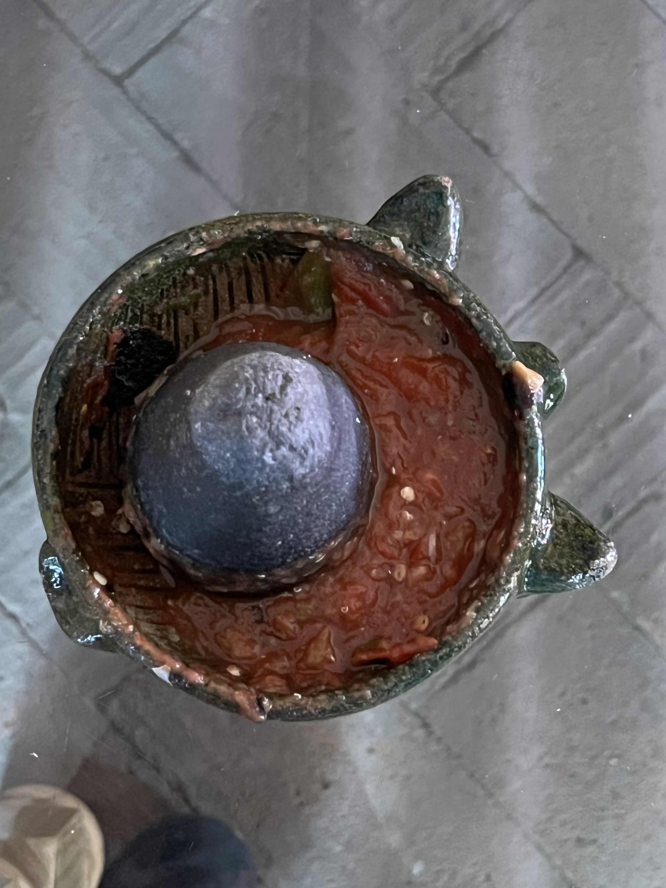
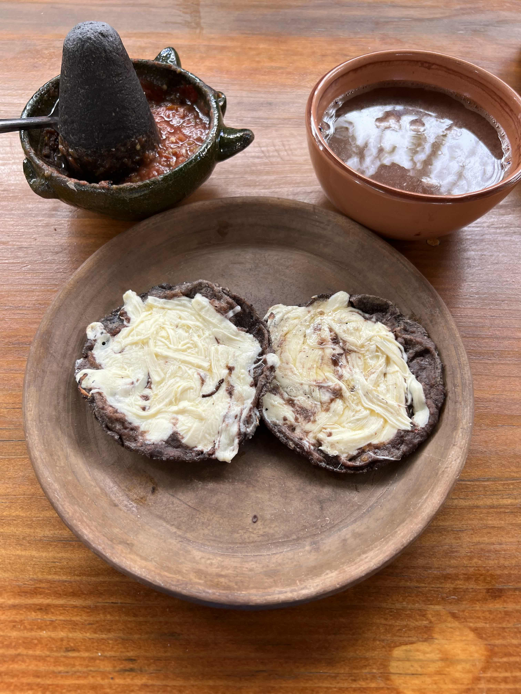
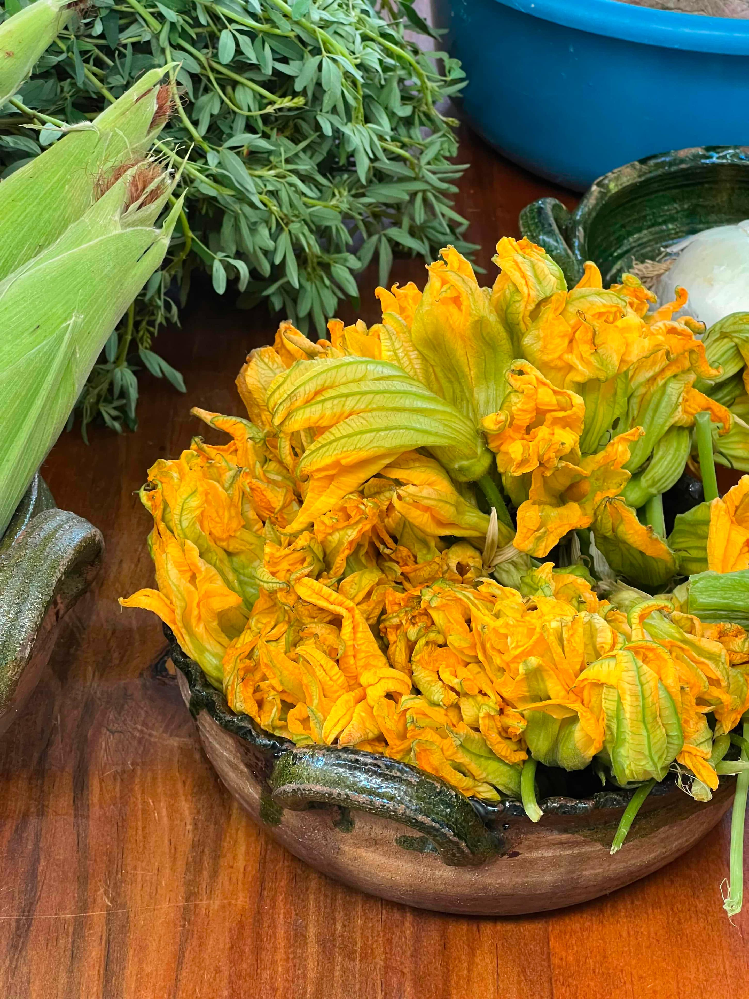
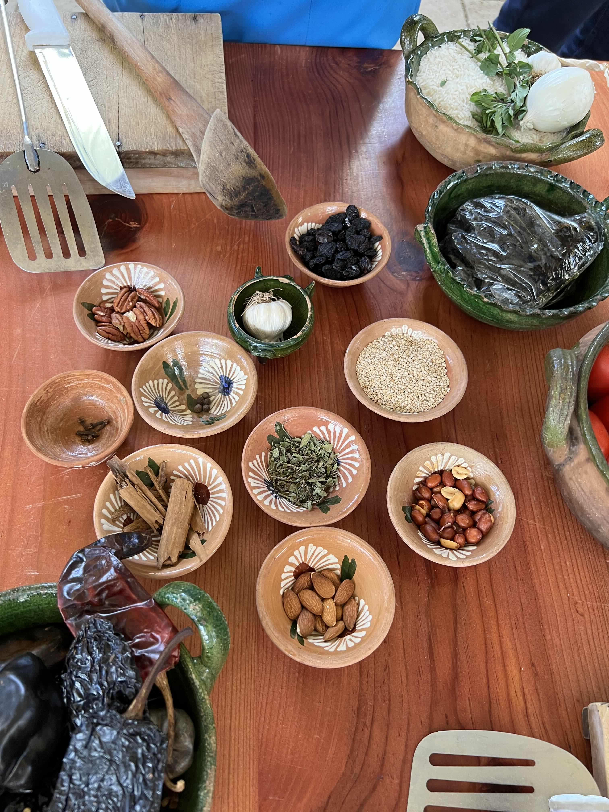
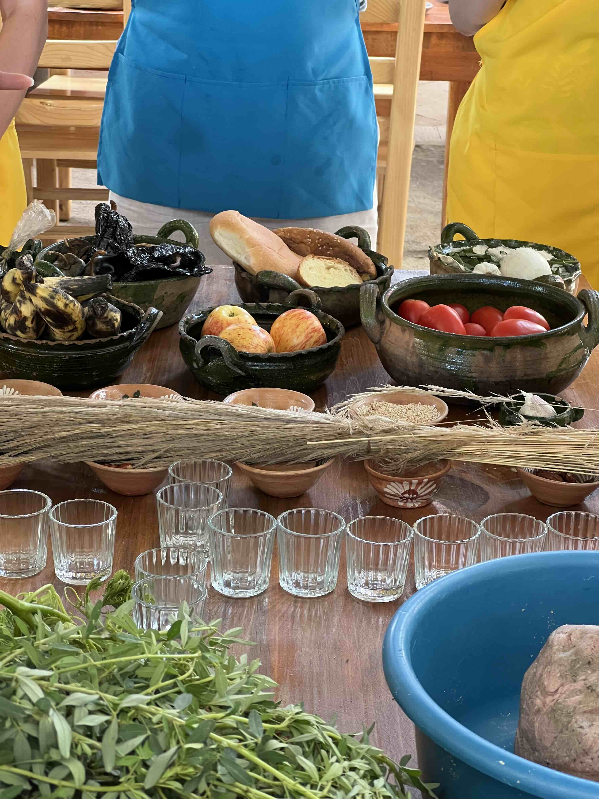
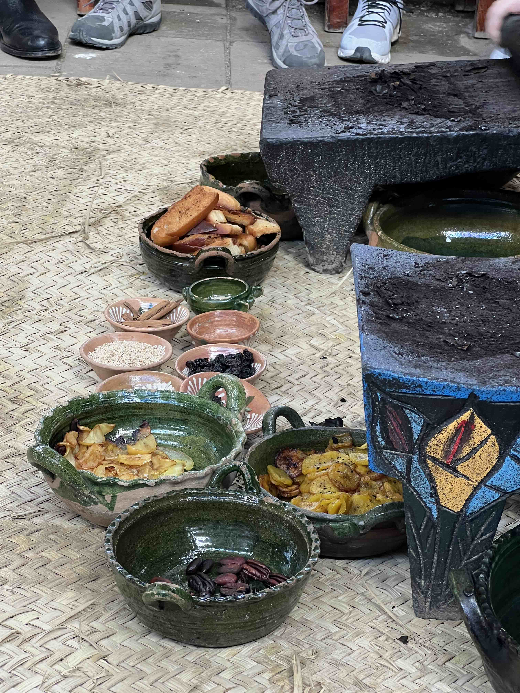
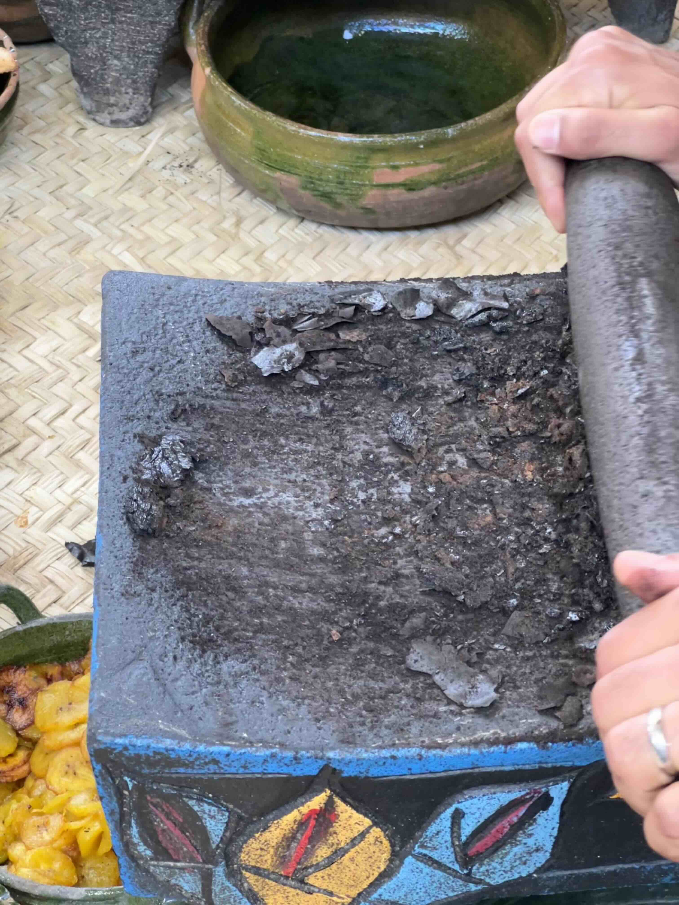
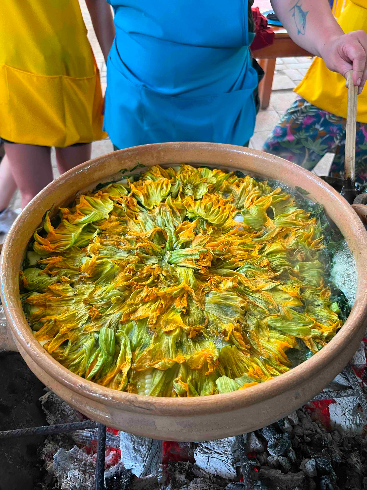
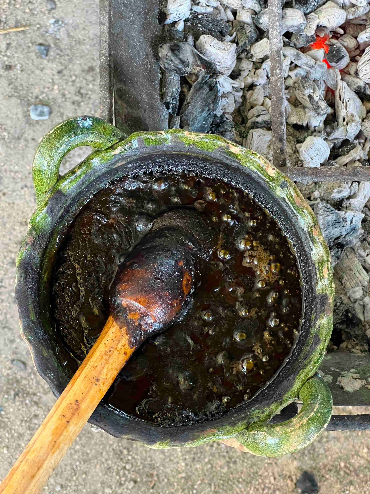

At Santo Domingo square, I met my Mexican driver. He hurried the eight of us into two compact cars. After a 30 minutes bumpy ride, we arrived at Mimi's cocina at Matadamas, a rustic town in the outskirts of Oaxaca. Her son, fluent in English, told us that Mimi inherited this farm house from her grandparents. I washed my hands at the entrance and greeted Mimi timidly. She beckoned me to shake hands. I showed my wet hand, but she insisted. We shook hand and she gave me a hug.

While having streets foods in Oaxaca, I had an observation: chefs prepared food without gloves, and only put them on to handle cash. To Mexican chefs, their hands are clean, and they cherish the direct connection between themselves and their craft. Later in the day, Mimi would drip tiny spoonful of soup and mole onto our palm to let us taste, despite the transient burning sensation. In United States, chefs would put on gloves to prepare food, and take them off to receive cash. The chef cooks as if operating a surgery. They prefer touching money over touching food with their hands.

After welcoming everyone, Mimi gathered us at a long table. We started the day making salsa in a *molcajete*, the traditional Mexican mortar. The ingredients and process were quite simple – grind garlic, serrano and tomato in the molcajete and mixin some salt. We used fresh vegetables picked from the field in the morning, and the flavor was so rich. We sat around the long dining table with our salsa. Mimi brought us bread, hot chocolate and memelas topped with queso oaxaca.

 

During the breakfast, Mimi asked us where are we from, what do we do and how are our families. She was especially curious about our families. "How are your parents"? "Do you have any siblings"? "You have any *novio*/*novia*?" After we all introduced ourselves and our families, she welcomed us again with "*mi casa es tu casa*".

Mexicans understand *familia* differently. To them, *familia* can extend to anyone that they know well enough to say "*mi casa es tu casa*". When I first came to Oaxaca and stayed in a host family, they thought of me as part of their *familia*. When I checked into my hostel, I became part of their *familia*, a group consisting of mostly foreign travelers. With no demarcation of blood bond, the Mexican *familia* cordially welcomes everyone. It is a very poetic idea: everyone can be my *familia*. I can make *mi casa* everyone's *casa*, and, in exchange, any place in the world can be *mi casa*.

After another round of exchanging small talks and gossips, we finished our brekfast. Mimi led us to another table full of local ingredients. With her, we would make the main dishs together: *sopa de guías de calabaza*, *mole negro* and *tortilla de maíz azul*. She poured each of us a shot of mezcal. We toasted, embraced the mezcal and got to work.

  

Here are the rough recipes for them.

***sopa de guía***

- char some garlic and onion
- clean and prepare chepil, squash, sqush vine and sqush flower
- put all ingredients into a pot with boiling water and simmer

***mole negro***

- fry apple and plaintain in oil for caramelization
- fry almond and walnut in oil till brown/black
- burn *chili ancho negro*, *chile guajillo* and *chilhuacle negro* till black and smokey
- grind on *metate* sequentially to make the paste
	- burnt chilis (to smokey powders)
	- apple and plaintain (to oily paste)
	- bread (for texture)
	- garlic, sesame, cinnamon, dried cranberry, anise, peppercorn
- squash tomato and add water for tomato paste
- mixin the black paste and the tomato paste. stir consistently

 

***tortilla de maíz azul***

- knead masa de maiz azul
- cut to smaller balls
- flatten each ball into a tortilla
- heat up on a *comal*

  

After two hours of toiling, we had our meal ready. Mimi gave us some fresh *agua de tuna* and thanked us for our effort. "*Mole negro* is not a casual dish you whip up for dinner," she said. In Mexico, *mole negro* is served in important occasions like marriage or *día de muertos*. In such occasions, the organizer finds all the grandmas that they can possibly find to take charge of the mole making. One time, the batch of mole Mimi was making was so gigantic that she had to keep stirring the mole for three hours until it's ready. For smaller families, they make a big batch of mole and eat it throughout weeks if not months. It's a monumental effort.

 

We savored our food, and waved goodbye to Mimi.
