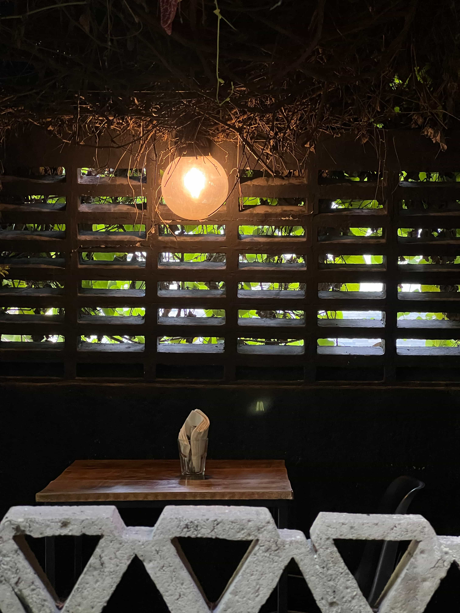

_Alcove at the entrance of Matraz Tostador_

---

Today is 8/2/23 and I'm at Guadalajara, Jalisco, Mexico. I'm currently writing at Matraz Cafe in Providencia. This morning, I took a taxi to this rich neighborhood. I ordered a flat white and some huevos for desayuno with the barista who spoke English well enough to reassure me that my English sprinkled with Spanish was well understood. The cafe has been playing English songs all morning. At this moment, it is playing Dreams by Fleetwood Mac.

I arrived in Guadalajara on 7/31/23, the last day of my H1B grace period. Guadalajara is a strange destination for a tourist like me, even more so considering it's my first time in Mexico. When I was planning my Mexico trip, I wanted to avoid the tourist crowds in Mexico City and Cancún. I searched for direct flights from San Jose to Mexico and found the flight to Guadalajara at an affordable price. I had never heard of this city before, but a random guy on Reddit [suggested](https://www.reddit.com/r/Shoestring/comments/trngmo/where_are_best_places_to_travel_in_mexico_if_you/i2nkj2k/?utm_source=share&utm_medium=web3x&utm_name=web3xcss&utm_term=1&utm_content=share_button) that it's like a "Mexican Brooklyn", so I booked my flight. A few days later, I arrived at GDL airport around 5am.

I waited at the airport for cafes in the city to open. I always meticulously research a city's coffee scene before I go. I make a list of cafes to try and choose AirBnB close to the one I think I'd love the most. This is not completely irrational. I have chosen my long-term leases next to cafes I love (Espresso Vivace in Seattle and Sey Coffee / Nook in Brooklyn). The qualities of neighborhood where good cafes can thrive — walkability, kindness, cleanness, among many others, overlap with the qualities I deeply care about. This time, I got three cafes in Guadalajara I plan to try: Matraz, El Terrible Juan and Taller de Espresso, and that is everything I planned for Guadalajara. Around 7am, I took a taxi to Matraz Tostador.

The taxi driver took some serious effort to talk to me. I thought he probably had not seen many Asian tourists in Guadalajara and was curious about me.

- _work?_
- _no_
- _familia?_
- _no_
- _tequila?_
- _no_
- _hmm..._

He knew little English and I knew about five Spanish words. While we were stuck in traffic, he opened Google Translate and spoke Spanish to the phone. It worked well enough for us to have a spoken conversation. I said I'd go to Oaxaca after Guadalajara. He commented that it's a beautiful city and it's more liberal. "For example, many people embrace feminism there," he said. The sudden spike of fidelity in our conversation, permitted through Google Translate, surprised me. I didn't expect the word "feminism", and I took notes to do more research about Oaxaca. I also asked him for recommendations on places to go, and he recommended Tequilla, a small town next to Guadalajara famous for its production of the liquor Tequilla. We arrived at Matraz Tostador. He scribbled down his number and said "you go Tequilla, call me," before taking off to meet the next passenger.

The neighborhood we stopped at was lush. Vehicles here are smaller and the road is narrower. Sidewalks are separated from the road by a plethora of plants. The overarching trees in the median of the road cast cool shades all over the place. I was reminded of Chiang Mai and immediatly felt at home.

I brought two books with me, The Timeless Way of Building by Christopher Alexander and Either/Or by Søren Kierkegaard. I have read both before, but I had some unexplainable intuition that I would want to reread them here in Mexico. With my luggage, I walked into Matraz Tostador.

The entrance reminded me of Alexander's writing on the quality without a name. As one walks through the narrow entrance, to the left is an alcove and to the right is a patio. The alcove is a private and dim-lit area, with one table and two chairs. It is, I suppose, a place for the quiet conversations that take place in the day, and for the solitary nightbird awake who needs to focus. The patio next to the sidewalk offers views of the pedestrians and the plants, but not the road traffic further away.

I sat in the patio and sipped my coffee. It did not disappoint, but I was too tired. I dozed off and woke up to find it was already afternoon. I headed to my hotel, checked in, slept, went outside for some food and slept again to finish my first day in Guadalajara.

---

Today is my third day at Guadalajara. I'm back to Matraz, this time in the Providencia neighborhood. In the past three days, between the two visits to Matraz, a thought emerged, took shape and finally crystallized into a resolution: learn Spanish.

I like learning languages. In addition to Chinese and English, I've been learning Japanese for many years and am quite fluent. I also dabbled in Germany and French. In 2020, I almost signed up for a Russian summer school in St. Petersburg before COVID hijacked the plan. However, out of all languages, the one I'm most excited to learn is French, as I hoped to read Camus, Gide, Barthes, Foucault and many others in French. As for Spanish, the only writer whose work I'm looking forward to reading in it is Borges. Learning Spanish was an unlikely choice for me.

Behind this resolution were a sting and a reflection. The sting was a very specific event. I came to a cafe, ordered a shakshuka and sat at the patio. There were a few tables occupied. People were dining and laughing with their friends and families. The atmosphere was relaxing and intimate. Yet I felt like an outsider. Conversations over coffee have a subtle openness — they permit overhearing generously, providing ephemeral glimpses into the life of others. I very much enjoy this aspect of a cafe shop, but that was cut off to me because of my inability to understand Spanish. So I opened my laptop to hide myself behind a screen. After a while, the waitress brought to me the shakshuka in a hot cast iron pan. She said a few sentences in Spanish with much hospitality and gentleness, but when she was met with my blank stare and hastiness to pull out my phone, she pointed to the pan and robotically uttered one word "hot", before smiling awkwardly and turning away. A moment ago, she was so lively, chatting with the other table to make sure everyone felt comfortable. The memory was so pungent that I made up my mind to learn some Spanish seriously. I refuse to be reduced to a juggler of five words in Spanish — I have so much more to say as a person. I don't want the same thing happen to people I talk to in Mexico.

The reflection, on the other hand, happened throughout my years of traveling. I have been thinking, for a long time, how to avoid feeling like an alienated bystander while traveling. Or, to quote from Susan Sontag's diary, that passive activity of tourism:

> A passive activity, an active passivity.
>
> ...
>
> Tourism essentially a passive activity. You set yourself in a certain surrounding — expecting to be excited, amused, entertained. You need bring nothing to the situation — the surrounding is sufficiently charged.
>
> Tourism and boredom.

I can't help thinking of her writing in On Photography:

> Photography implies that we know about the world if we accept it as the camera records it. But this is the opposite of understanding, which starts from not accepting the world as it looks. All possibility of understanding is rooted in the ability to say no. Strictly speaking, one never understands anything from a photograph. Of course, photographs fill in blanks in our mental pictures of the present and the past: for example, Jacob Riis's images of New York squalor in the 1880s are sharply instructive to those unaware that urban poverty in late-nineteenth-century America was really that Dickensian. Nevertheless, the camera’s rendering of reality must always hide more than it discloses. As Brecht points out, a photograph of the Krupp works reveals virtually nothing about that organization. In contrast to the amorous relation, which is based on how something looks, understanding is based on how it functions. And functioning takes place in time, and must be explained in time. Only that which narrates can make us understand.

How should I travel, if my goal is to gain some understanding of a foreign culture? I think learning the language will get me closer, whereas taking photos will pull me further away. Camera solicits. One has a frame and memory card for the locality to fill. The process is one of appropriation — it represents the photo taker's perspective more than the subject being taken. In contrast, language provides. In sharing, one gives one's self to the surroundings. Through interactions with local people and place one may gain some understanding. Only that which _narrates_ can make us understand...

So I began my Spanish learning joruney. I started going through Memrise's Spanish lessons. Yesterday, I also did my first online Spanish lesson on Chatterbug. On this Sunday, I'll leave Guadalajara for Oaxaca. I signed up for classes and homestay at [Oaxaca Spanish Magic](http://www.oaxacaspanishmagic.com). In the remainder of this week, I want to come up with a rough study plan, paying attention to my own _processs_ of acquiring a new language. My rough thinking is that instead of being a consumer of the existing language learning tools, I'd like to make new language learning tools tailored to my own needs. Vamos!

---

A few anecdotes:

Guadalajara's coffee scene is surprisingly good. I have had many good flat whites and pourovers for ~ $3 USD.

Most of the cafes here have a quiet patio to sit at, and they all offer WiFi > 100 mbps. It's great for remote working.

While researching Guadalajara's coffee scene, I found the [Mexican Speciality Coffee Tasting & Cupping even by Dan](https://www.airbnb.com/experiences/4715638). I looked up Dan's cafe and sent him some inquiries on Whatsapp. He kindly responded to all my inquiries and shared with me a [Guadalajara Coffee Map](http://bit.ly/barrasgdl). The map has more than 100 places and I was skeptical: are there so many good cafes in Gudalajara? Turns out there are!

People are exceedingly nice here. A barista told me people here are more chill compared to people in Mexico City.

A random guy stopped me and asked if I come from China. I said yes, dubiously. I thought he was asking for money. Umm, he said he likes Bruce Lee and thanked me for bringing good spirit to here. I was bemused.

The city feels pretty safe. Maybe it's because I was mostly in Colonia Americana, Centro and Providencia, but I felt pretty comfortable walking to a night market for food at 9pm. 
