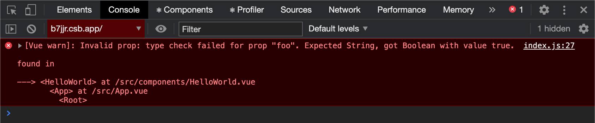

Since [0.28.0](https://github.com/vuejs/vetur/releases/tag/v0.28.0), Vetur offers cross-file Prop Type Validation.

Docs are [here](https://vuejs.github.io/vetur/interpolation.html#prop-type-validation). In short, this works with:

- `export default {...}` in JS files
- `defineComponent` in TS files with Vue 3
- `Vue.extend` in TS files with Vue 2
- TS types defined with [`Vue.PropType`](https://vuejs.org/v2/guide/typescript.html#Annotating-Props)

You can use [VTI](https://vuejs.github.io/vetur/vti.html) to get validation errors on CLI.

Some todos I plan to work on:

- Make updates in `Child.vue` refresh `Parent.vue`'s diagnostics
- Make `v-model`, dynamic `v-bind`, object `v-bind` work
- Allow renaming props
- Allow [Component Data](https://vuejs.github.io/vetur/component-data.html) to define types. For example, if [`name`](https://router.vuejs.org/api/#name) of `router-view` element is defined as:
  ```json
  {
    "name": {
      "type": "string",
      "description": "When a `<router-view>` has a `name` prop..."
    }
  }
  ```
  then `<router-view> :name="42"` should generate an error.

Here's a quick demo. You can also clone [octref/vue-prop-type-validation](https://github.com/octref/vue-prop-type-validation) to play with it:

<video autoplay loop muted playsinline controls>
  <source src="/media/vue-prop-type-validation/vue-prop-type-validation.mp4" type="video/mp4">
</video>

In the remainder of this post, I'll touch upon these topics:

- [Why Prop Type Validation](#why-prop-type-validation)
- [How Prop Type Validation works](#how-prop-type-validation-works)
- [Sponsorship and future development](#sponsorship-and-continued-development)

## Why Prop Type Validation

To understand Prop Type Validation's benefits, let's take a look at two things. Vue's [prop type check](https://vuejs.org/v2/guide/components-props.html#Type-Checks) and TypeScript's benefits.

Vue's prop type check doesn't use TypeScript types and doesn't generate errors on either IDE or CLI. If you pass a boolean to a string prop, you only get a warning in the browser console:



For TypeScript users, this doesn't suffice. When people ask for "TypeScript support", what they really mean is "tooling support". Compiler that checks types. IDE that reveals type errors. Auto-completion of all properties in an object. Hover that shows type information. Reliable rename that works across the codebase. 

When you are working on a pure TypeScript codebase, you feel every file is covered by the type system. If changing a type generates 20 errors, fixing these 20 errors is all you need to do to get the code running again. Not one more, not one less.

A Vue project, even written in TypeScript, still contains template code that is not covered by the type system. Sure you can write TSX, but Vue people like SFC and Vue templates. When you add, rename, change-type-of a prop, you do not know how many errors will such a change generate, and where such errors are. This limits your ability to refactor, which is essential to keeping a large codebase clean and organized.

Vetur's Prop Type Validation fills the gap. Together with [Generic Vue Template Interpolation Language Features](/generic-vue-template-interpolation-language-features), Vetur now provides auto-completion, type checking, jump-to-definition and find-references for Vue Single File Components. Refactor and rename need more work, but they'll come as well.

Additionally:

- [VLS](https://www.npmjs.com/package/vls) makes these features available to any [Language Server Protocol](https://microsoft.github.io/language-server-protocol/) compatible clients.
- [VTI](https://www.npmjs.com/package/vti) surfaces prop validation errors on the command line (so you can use them in Continuous Integration).
- (WIP) Component Data will allow libraries to specify component attribute type, with which Vetur will perform Prop Type Validation.

This is similar to the TypeScript ecosystem:

- VLS -> [TSServer](https://github.com/Microsoft/TypeScript/wiki/Standalone-Server-(tsserver))
- VTI -> `tsc`
- Component Data -> `d.ts` files and [DefinitelyTyped](https://github.com/DefinitelyTyped/DefinitelyTyped)

With Prop Type Validation, I hope Vetur can help you navigate through complex Vue codebases and make changes with confidence.

## How Prop Type Validation works

When you are editing a `.vue` file in [Vetur](https://github.com/vuejs/vetur), you can run the command `Vetur: Show corresponding virtual file and sourcemap` to view the internal TypeScript representation of the Vue file. This virtual TypeScript file powers Vetur's [Interpolation Support](https://vuejs.github.io/vetur/interpolation.html), and is now extended to support Prop Type Validation.

Given two Vue files, such as [Child.vue](https://github.com/octref/vue-prop-type-validation/blob/master/src/Child.vue) and [Parent.vue](https://github.com/octref/vue-prop-type-validation/blob/master/src/Parent.vue):

```vue
<!-- Child.vue -->
<script lang="ts">
import Vue, { PropType } from 'vue'

export default Vue.extend({
  props: {
    str: String as PropType<'foo' | 'bar'>,
    num: Number
  }
})
</script>
```

```vue
<!-- Parent.vue -->
<template>
  <child :str="myStr" :num="42"></child>
</template>

<script>
import Child from './Child.vue'
export default {
  components: {
    Child
  },
  props: {
    myStr: String,
    myNum: Number
  }
}
</script>
```

Vetur roughly translates `Parent.vue` into [`parent-vue-transformed.ts`](https://github.com/octref/vue-prop-type-validation/blob/master/src/parent-vue-transformed.ts):

```ts
// parent-vue-transformed.ts
import Vue from 'vue'

const __vlsComponent = Vue.extend({
  props: {
    myStr: String,
    myNum: Number
  }
})

export declare const __vlsRenderHelper: {
  <T>(Component: (new (...args: any[]) => T), fn: (this: T) => any): any;
};
export interface __vlsComponentData<T> {
  props: Record<string, any>;
}
interface __vlsComponentData__child<T> extends __vlsComponentData<T> {
  props: { str: 'foo' | 'bar'; num: number; [other: string]: any }
}
declare const __vlsComponentHelper__child: {
  <T>(
    vm: T,
    tag: string,
    data: __vlsComponentData__child<Record<string, any>> & ThisType<T>,
    children: any[]
  ): any
}

__vlsRenderHelper(__vlsComponent, function () {
  __vlsComponentHelper__child(
    this,
    'child',
    { props: { str: this.myStr, num: 42 } },
    []
  )
})
```

If you open this TS file in VS Code, you'll see an error on `str: this.myStr`, saying `Type 'string' is not assignable to type '"foo" | "bar"'`.

What Vetur does is to:
- Collect each components' prop information and build interfaces such as `__vlsComponentData__child`. 
- For each parent component, transform its Vue template into TS code with its children components' interfaces
  - Meanwhile, generate a [sourcemap](https://blog.matsu.io/generic-vue-template-interpolation-language-features#problems) from its Vue template to the transformed TS file
- Get all diagnostic errors on the transformed TS file
- Convert the range of the diagnostics errors by mapping them back to the Vue template with the sourcemap

## Sponsorship and continued development

When I [left](https://blog.matsu.io/on-leaving) US and my work at Microsoft, I decided to give more time to my personal researches and pursuits, and only commit at most 15 hours/week to Open Source. Prop Type Validation took way more time and energy than I expected, but I still tried to finish it because I believe this feature makes Vue great. Through [VLS](https://www.npmjs.com/package/vls), Prop Type Validation will be made available to [Atom](https://atom.io/packages/ide-vue), [Sublime Text](https://packagecontrol.io/packages/LSP-vue), [Vim/Neovim](https://github.com/neoclide/coc-vetur), [OniVim](https://github.com/onivim/oni2/issues/1058), [Emacs](https://github.com/emacs-lsp/lsp-mode) and [CodeSandbox](https://codesandbox.io/post/announcing-codesandbox-v3). I hope it helps you enjoy Vue.

I want to offer my thank-you to all my [sponsors](https://matsu.io/sponsors). Special thank-yous to [Katashin](https://github.com/ktsn) who implemented the original template interpolation transformer, to [Yoyo](https://github.com/yoyo930021) who made a lot of high-quality contributions recently to Vetur, and to [Evan](https://github.com/yyx990803) who has been sponsoring my work while delivering a great Vue 3. Your support gives me momentum to push Vetur further.

This year I'm applying to grad school. The earliest deadline is Dec 1. I'll try to allocate some time for Vetur, but I'll have to prioritize my application over Open Source for the next few months.

With pressure from applying to graduate school and from not having a regular paying job, I find it harder and harder to commit more time to Vetur. **If you find Vetur useful, please consider [sponsoring](https://github.com/sponsors/octref) my continued development to lessen  my financial burden. Thank you.**

*A map of my sponsors, [updated daily](https://github.com/octref/sponsors-map). I feel incredibly fortunate to be receiving support coming from five continents...thank y'all.*

<div class="gallery">
<figure>
  <a target="_blank" href="https://matsu.io/sponsors">
    
  </a>
</figure>
</div>